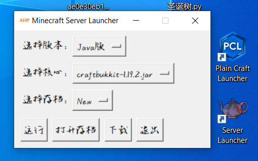

# Minecraft Server Launcher

I AM A CHINESE README, THANKS FOR YOUR UNDERSTANDING!

## 我的世界服务器启动器

### 零、注意

本项目执行 GNU AGPL
#### 历史版本：
2023‎年10月‎25‎日：1.4.0
2023‎年‎08‎月‎29‎日：1.3.0 （上传时间：2023年10‎月‎16‎日）
#### 未发布版本：
2023‎年‎05‎月‎02‎日：1.2.0
2023‎年‎04‎月‎11‎日：1.1.0
2023‎年‎04‎月‎09‎日：出现

### 一、背景

编写日期：2023年04月09日（初二时）
这个启动器最初是为了更换地图版本、核心和使用命令行进行JDK选择而创建的。当时并没有考虑开源，所以代码质量有限，请见谅。

### 二、使用

此图展示 3.0 版本，图片仅供参考。

<h5>使用步骤如下：</h5>

1. 选择所需版本
2. 下载相应版本
3. 选择核心
4. 选择存档
5. 打开选定的存档
6. 启动服务器
7. 为存档命名
8. 在Minecraft内使用"stop"命令停止服务器
9. 退出启动器
其他功能请自行探索。

### 后记

最后，这些代码实际上都是我在学生时代（我是 07 年的ye~）编写的产物。当时我的英语水平不太好，所以可能会出现一些奇怪的命名问题。请大家凑合着看，只要能正常运行就好，希望不要太苛刻。大家可以自由地fork这个项目，或者对代码进行修改并使用，我不会干涉。非常感谢大家的支持。

#### 相关内容

域名（没用）：xueqian.pro
视频号：

